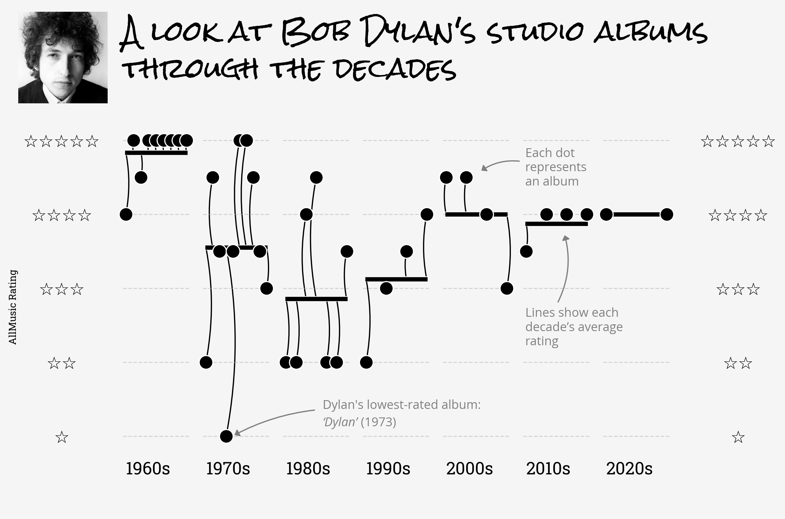

Bob Dylan: Album Ratings Over Time 🎶

**tl;dr:** Each dot is a Dylan studio album, rated by *AllMusic*. Arranged by decade, the scatterplots aim to mimim the look and feel of sheet music — a fitting way to track Dylan’s ups, downs, and comebacks.  

Dylan's 60s output stands out as the most consistent and acclaimed. After a bumpy ride through the ’70s, ’80s, and ’90s (with fewer albums being released since the 90s), his albums recovered critically and became more stable again in the 2000s, 2010s, and 2020s.

---

## 📊 

---

## Data

- Album release information: [Wikipedia — Bob Dylan discography](https://en.wikipedia.org/wiki/Bob_Dylan_discography)  
- Album ratings: [AllMusic](https://www.allmusic.com/)  

